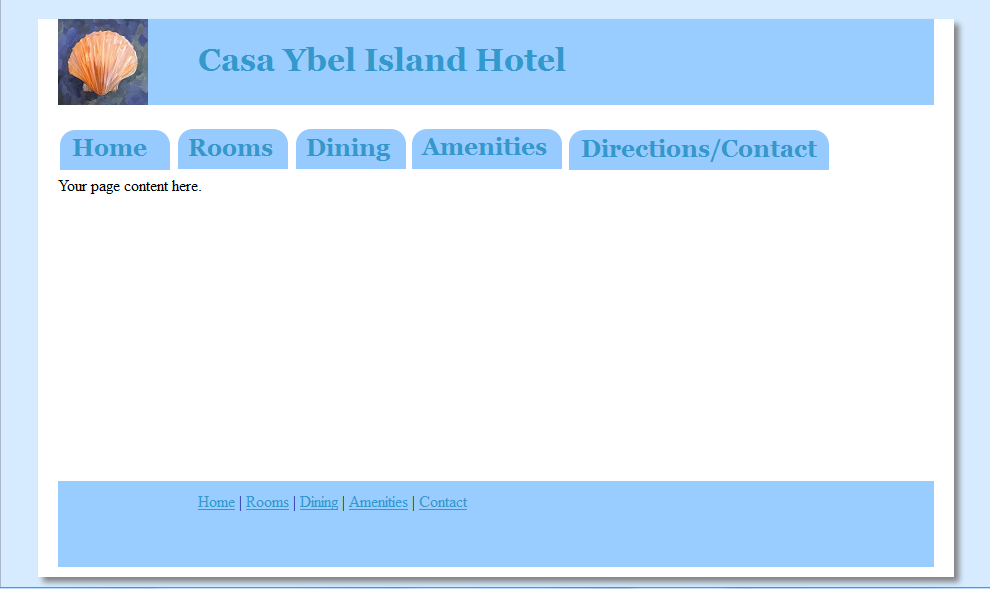

Intro HTML Final Project

You are to create a website for the (fictional) hotel: "Casa Ybel Island Hotel".
You may use the images provided and/or include your own. Remember to resize images 
with the width and height attributes as needed.
Feel free to add your own interpretation of the basic design spec below.

The site will have the following pages:

Home Page 
Dining Page
Rooms Page
Hotel Amenities Page
Directions/Contact Page

These are the site's html files (name the home page "index.html").

The site textual content for each page is located in the file: [SiteContent.txt](SiteContent.txt) 

Requirements:

1) Name your project "Casa Ybel Island Hotel"

2) there must be a "css" folder containing all stylesheets.

3) all image files are in an "images" folder.

4) Create a page template. This code will appear on all pages. Use an external stylesheet.
   The template should look like `ExamplePageTemplate.png`

  The template must include the following:

  Style the body tag with a background color ##d6ebff.

  Create an id style called "page-wrapper". This style is referenced by a div element that encloses eveything inside the body.
  The page-wrapper style includes these rules:
    <pre>
   width:90%;
   margin: auto;
   background-color:#ffffff;
   padding: 0 20px 10px;
   box-shadow: 5px 5px 5px #828282;
    </pre>

  A `<header>` section that includes a `<h1>` tag containing the title text "Casa Ybel Island Hotel" as seen in the image file.
  The `<h1>` tag may be styled with the following:
   <pre>
   background-color:#99ccff;
   color:#3399cc;
   font-family: Georgia, "Times New Roman", serif;
   line-height: 250%; 
   height: 86px; 
   text-indent: 140px;
    </pre>

   also, include the background image "shellsmall.jpg" and set the background position to left.

  A `<nav>` section that contains links to all pages using the images provided for the link text.

  A `<footer>` section that contains links to all pages. You may style the <footer> tag with these rules:
    <pre>
     background-color:#99ccff;
	 line-height: 250%; 
	 height: 86px; 
	 text-indent: 140px;
    </pre>

5) Add a favorite icon (favicon) for all pages on the site. Use the image file "shell.ico".

6) Place the page content provided for each page (as found in the SiteContent.rtf file) in the appropriate html page. 
   The content must appear in a presentable format.
   You must include at least one image per page (apart from the header and nav images) from the available images. 
   List headings should be styled so they stand out- at minimum they should be a larger font size than the list items. 
   A consistant look across all pages is required. That means that heading and list styles are applied consistently.
   

